<div align="center">

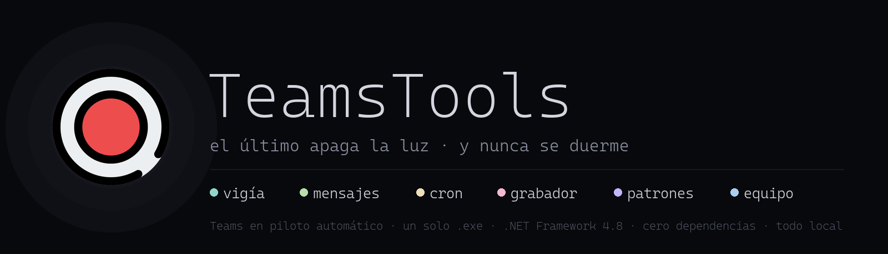

**Teams en piloto automático: sale sola de la reunión cuando la sala se vacía, no te deja en Ausente, contesta los chats por vos, y graba, transcribe y resume cada llamada. Todo sin que Teams se vea nunca en pantalla.**

Un solo `.exe` de ~1,1 MB sobre .NET Framework 4.8 (ya viene con Windows), **cero paquetes**: ni NuGet, ni Electron, ni WebView. Lee Teams por accesibilidad, dibuja toda su interfaz a mano y guarda todo en tu disco.


[](https://github.com/agustinyarrus/teamstools/releases/latest)
[](https://github.com/agustinyarrus/teamstools/releases)

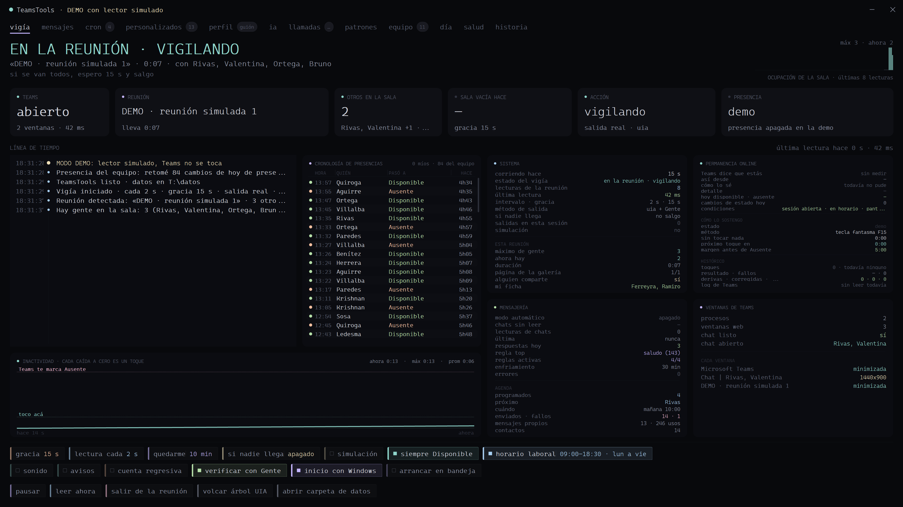

</div>

> [!NOTE]
> Todas las capturas de este README salen de la **demo** de la app (`TeamsTools.exe --demo`) con un equipo, un historial y unas reuniones **inventados**. No hay una sola persona real en ninguna imagen.

---

## Índice

- [Qué es](#qué-es)
- [Lo que hace, en una tabla](#lo-que-hace-en-una-tabla)
- [Las pantallas](#las-pantallas)
- [Cómo lo hace](#cómo-lo-hace)
- [El grabador de llamadas](#el-grabador-de-llamadas)
- [La transcripción como conversación](#la-transcripción-como-conversación)
- [Instalación y primer arranque](#instalación-y-primer-arranque)
- [Qué necesita cada función](#qué-necesita-cada-función)
- [Línea de comandos](#línea-de-comandos)
- [Ajustes](#ajustes)
- [Los archivos de datos](#los-archivos-de-datos)
- [Compilar](#compilar)
- [Pruebas](#pruebas)
- [Límites honestos](#límites-honestos)
- [Privacidad](#privacidad)
- [Licencia](#licencia)

---

## Qué es

Cinco oficios en una sola app que vive en la bandeja:

1. **El vigía** mira la reunión de Teams por UI Automation (aunque esté minimizada), cuenta cuánta gente hay y, cuando se van todos, **sale sola** después de una gracia. Antes de irse abre el panel «Gente» y confirma que de verdad no queda nadie.
2. **La permanencia online** no deja que Teams te marque *Ausente* mientras estás mirando el monitor sin tocar nada: una **tecla fantasma (F15)** reinicia el reloj de inactividad sin mover el mouse ni escribir. Si igual Teams te manda a Ausente, lo rescata desde el menú del avatar, invisible. Lo que pongas a mano se respeta.
3. **La mensajería invisible**: un **modo automático** que contesta los chats que llegan con reglas (regex, señales del mensaje, horarios, cupos, o redactadas por un modelo local), un **cron** de recordatorios a compañeros («cada laborable 9:15», «mañana 10:00», «17/10 15:00») y **mensajes personalizados** de un clic. Teams **nunca aparece en pantalla**, ni siquiera cerrado a la bandeja.
4. **El grabador** graba cada llamada (lo que sale por los parlantes **y** tu micrófono, con los auriculares que se conectan a mitad de la llamada), la archiva en `.opus`, la **transcribe con motores locales** (Cohere, Parakeet o whisper), separa **quién habla** y la resume con un modelo local. Después la muestra **como una conversación**: cada voz con su color, karaoke con el audio, búsqueda, nombres.
5. **Los datos**: patrones raros en la presencia del equipo, **quién estuvo en llamada con quién**, cuánto te hacen esperar y a quién le debés respuesta, tu día hora por hora, la salud de la propia app y un buscador sobre **todo el historial** de Teams leído del disco, sin abrir Teams ni tocar la nube.

Todo corre en tu máquina. Nada sale a internet. La app no se instala: es un `.exe` que guarda sus datos al lado.

---

## Lo que hace, en una tabla

| Pestaña | Qué muestra | De dónde sale |
|---|---|---|
| **vigía** | la reunión en curso (quiénes, cuántos, cuánto lleva), la cuenta regresiva de salida, la ocupación de la sala, la inactividad y cada toque de F15, la línea de tiempo de la app, la cronología de presencias | UI Automation sobre la ventana de la reunión + el log nativo de Teams |
| **mensajes** | el autocontestador: reglas con probador en vivo, la bandeja de lo que entró y lo que contestó, la regla más usada | `respuestas.json`, `bandeja.jsonl` |
| **cron** | recordatorios con lenguaje natural, el calendario de la semana, el historial de disparos y por qué falló uno hace tres días | `recordatorios.json` |
| **personalizados** | mensajes propios de un clic con formato, agenda de contactos con la presencia en vivo, quién se conectó y se desconectó | `personalizados.json`, `contactos.json`, la lista de chats de Teams |
| **perfil** | el guión de presencia (Disponible 90 min → Ausente 6 → …) que hace que tu estado parezca de una persona, y qué está haciendo la permanencia online | `guion.json` |
| **ia** | once micromodelos deterministas que leen tus conversaciones: a quién le debés respuesta, qué prometiste, vencimientos, todo lo que tocó producción, temas calientes | el historial de Teams |
| **llamadas** | la grabación en curso con su pulso, el recorrido de cada reunión (grabación → .opus → texto → resumen), la lista de reuniones y el visor de la transcripción | el grabador, `grabaciones\` |
| **patrones** | anomalías en tu presencia y la del equipo, **quién está en call con quién**, las llamadas del equipo, quién vive en reuniones | `presencia.jsonl`, `corrillos.jsonl`, `mi-presencia.jsonl`, el historial |
| **equipo** | cuatro lentes sobre la misma gente: *ahora*, *historia*, *esperas* (quién hace esperar a quién) y *ritmo* (su franja horaria, sparkline de 24 h) | la lista de chats + el historial entero |
| **día** | mapa de calor de tu presencia día × hora, los tramos de hoy, cambios por día | `mi-presencia.jsonl` |
| **salud** | diez chequeos en vivo con evidencia y milisegundos: Teams, el log nativo, el avatar, el reloj de inactividad, la sesión, el disco, la coherencia entre fuentes, la permanencia, los micromodelos y el modelo local | todo lo anterior |
| **historia** | buscador sobre decenas de miles de mensajes (varias palabras, conversación, autor, rango), con las señales de cada mensaje | el extractor de IndexedDB |

Y afuera de las pestañas: el **overlay** de cuenta regresiva abajo a la derecha, el **ícono de la bandeja** que cuenta el estado sin abrir nada, el **REC** en la barra de título mientras graba, un **atajo global** (Ctrl+Alt+C) para prender el modo automático desde cualquier app, y una **línea de comandos** para manejar la instancia abierta y probar cada pieza sin interfaz.

---

## Las pantallas

Ventana sin marco, negro puro (`#08090c`), Cascadia Code en pesos finos y acentos pastel. Todo dibujado a mano: tablas con columnas arrastrables, fichas, series temporales, mapas de calor, chips, editores con formato. El hilo de la interfaz **nunca espera a nada**: ni disco, ni procesos, ni Teams, ni red (más abajo se cuenta cómo).

Cada pestaña va con su captura completa a **4K** (hacé clic para verla entera) y, debajo, **recortes a tamaño natural** de sus componentes.

### vigía

La reunión en curso, arriba. Las seis tarjetas: Teams, reunión, otros en la sala, sala vacía hace, acción y presencia. Abajo a la izquierda la **línea de tiempo** (el log de la app, con colores por nivel), la **cronología de presencias** (la tuya desde el log nativo, la del equipo desde la lista de chats) y la serie de **inactividad**: un diente de sierra donde cada caída a cero es un toque de F15 antes de que Teams te marque Ausente. A la derecha, cuatro fichas: sistema, permanencia online, mensajería y ventanas de Teams.


<p align="center">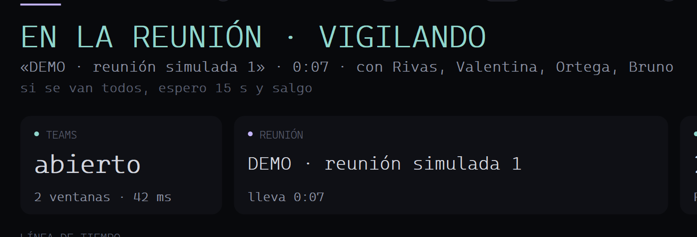<br><sub>El hero: el estado en grande, la reunión, cuánto lleva y con quiénes; y las dos primeras tarjetas.</sub></p>

<p align="center">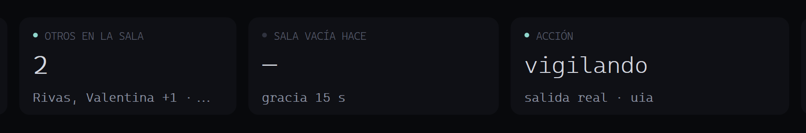<br><sub>Otros en la sala (con los nombres leídos de la galería), sala vacía hace y la acción que viene, con el método de salida.</sub></p>

<p align="center">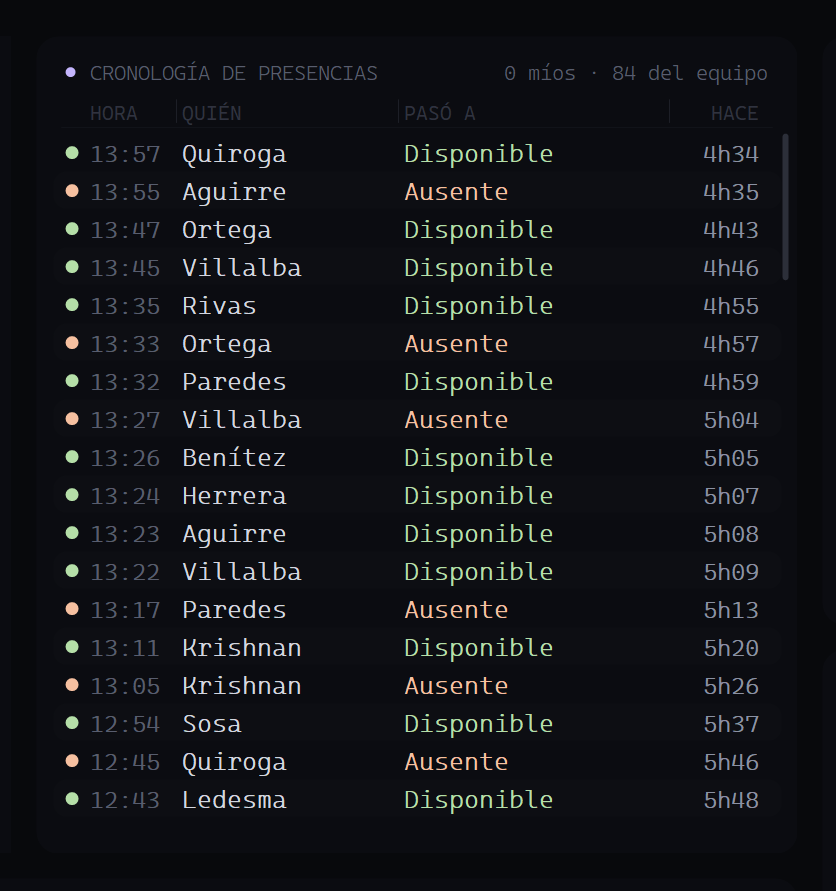<br><sub>La cronología de presencias: cada cambio del equipo con su hora, leído de la lista de chats sin abrir nada. Al arrancar, retoma los de hoy desde el disco.</sub></p>

<p align="center">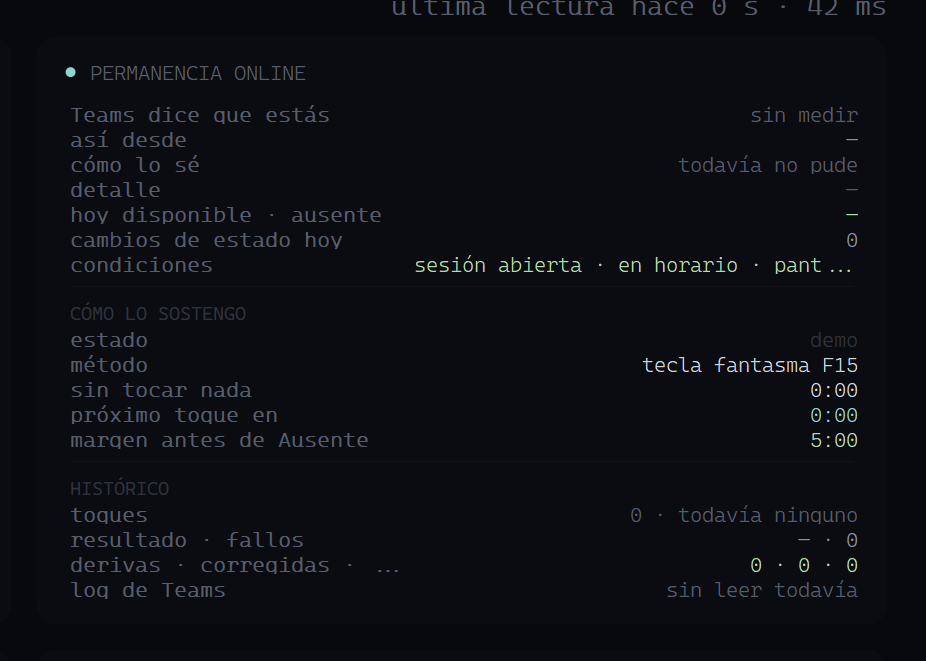<br><sub>La ficha de permanencia online: qué dice Teams que estás, desde cuándo, cómo lo sé, el método, el margen antes de Ausente y el histórico de toques, derivas y forzados.</sub></p>

<p align="center">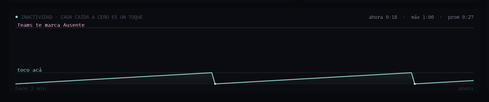<br><sub>La inactividad, segundo a segundo: sube hasta el umbral («toco acá») y cae a cero con cada tecla fantasma. La línea de arriba es donde Teams te marcaría Ausente.</sub></p>

Cuando la sala se vacía, el hero cambia al anillo de cuenta regresiva y el overlay aparece abajo a la derecha, sin robar el foco, con tres botones: **Salir ahora**, **Quedarme N min** y **No salir esta vez**.

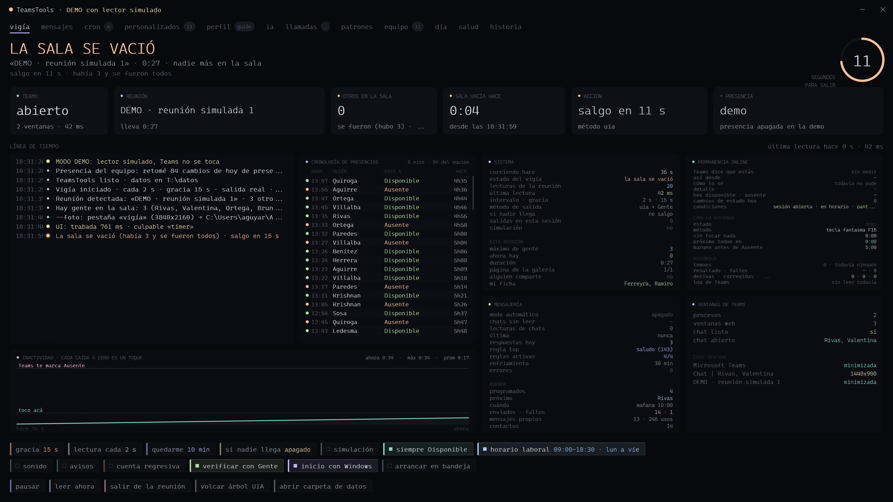

<p align="center">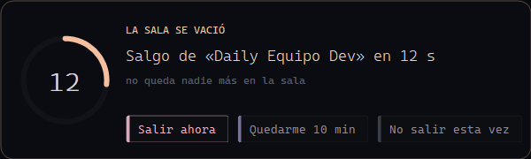 &nbsp; 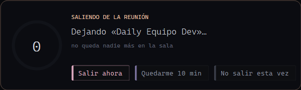<br><sub>El overlay: siempre visible, nunca activo. A la izquierda la cuenta regresiva; a la derecha, saliendo.</sub></p>

<p align="center">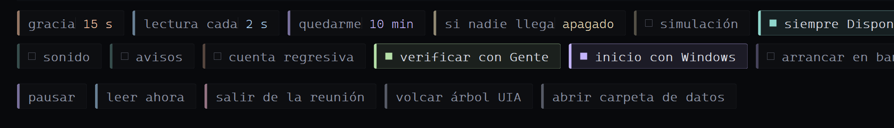<br><sub>Los chips de abajo cambian los ajustes en vivo (clic = siguiente valor, clic derecho = anterior) y se guardan en <code>config.json</code>.</sub></p>

### la bandeja

El ícono se dibuja en vivo, 32 × 32, y cuenta el estado sin abrir nada: un color por situación, el número de segundos cuando la sala se vació, y, mientras el grabador trabaja libre de llamadas, un **anillo malva que se llena** en sentido horario con el punto del medio llenándose como un vaso (crema si la transcripción está en pausa esperando que cortes).

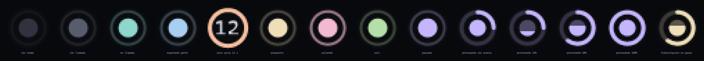

<p align="center"><br><sub>El anillo, llenándose mientras se transcribe una reunión.</sub></p>

El menú del ícono: mostrar el panel, modo automático, mantenerme Disponible, pausar la vigilancia, modo simulación, salir de la reunión ahora, volcar el árbol UIA, abrir la carpeta de datos, cerrar. Los globos avisan lo justo: «La sala se vació», «Salí de la reunión», «Le contesté a …», «Recordatorio enviado a …», «Transcripción lista» (tocá el globo y abre esa grabación).

### mensajes · el autocontestador

Reglas ordenadas: gana la primera que coincide. Cada regla tiene su patrón (regex o texto suelto), a quién aplica, si contesta en grupos, enfriamiento, espera antes de contestar (para no parecer un robot), tope por día, franja horaria y días, **señales que exige o bloquea** (los micromodelos: `+urgencia +ticket −bot`), y una respuesta con formato de una o varias burbujas, con imágenes, o **redactada por el modelo local** con la instrucción que le des.

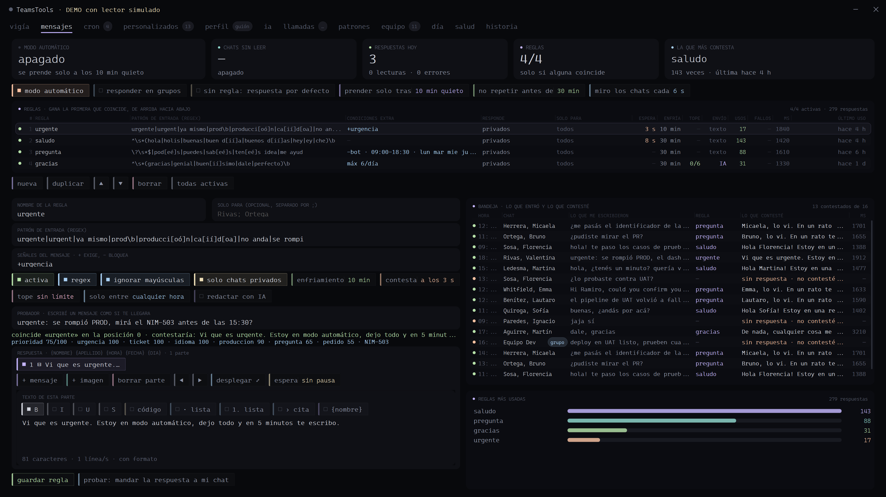

<p align="center">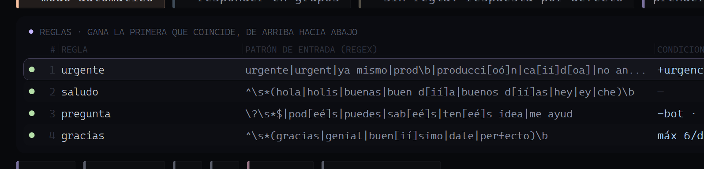<br><sub>Las reglas: patrón, condiciones extra (señales, horario), a quién responden, espera, enfriamiento, tope, tipo de envío, usos, fallos y milisegundos.</sub></p>

<p align="center">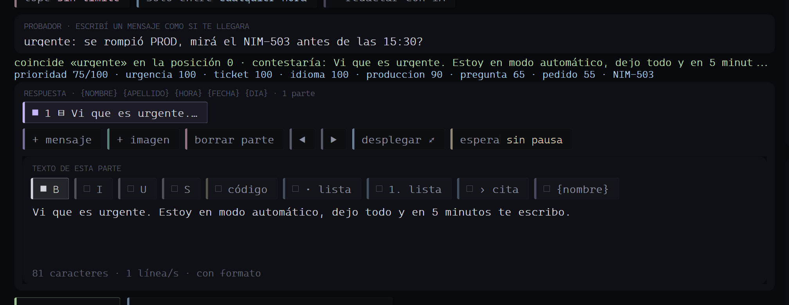<br><sub>El probador: escribís un mensaje como si te llegara y dice qué regla contestaría, exactamente qué diría, por qué las otras quedaron afuera y qué señales vieron los micromodelos (prioridad 75/100: urgencia, ticket, producción, pregunta…).</sub></p>

<p align="center">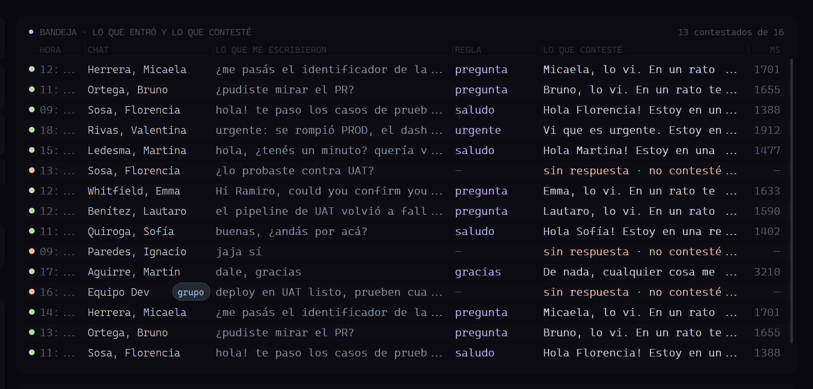<br><sub>La bandeja: cada mensaje que entró, la regla que lo atendió, lo que se contestó y en cuántos milisegundos; y los que no se contestaron, con el motivo.</sub></p>

### cron · recordatorios

«mañana 10:00», «en 45 min», «lunes 9:30», «cada laborable 9:15», «cada lun,mie 10:00», «cada 3 días 14:00», «el 1 de cada mes 09:30», «el último viernes 17:00», «17/10 15:00». El parser entiende todo eso y muestra, antes de guardar, **cuándo caería** cada uno de los próximos disparos.

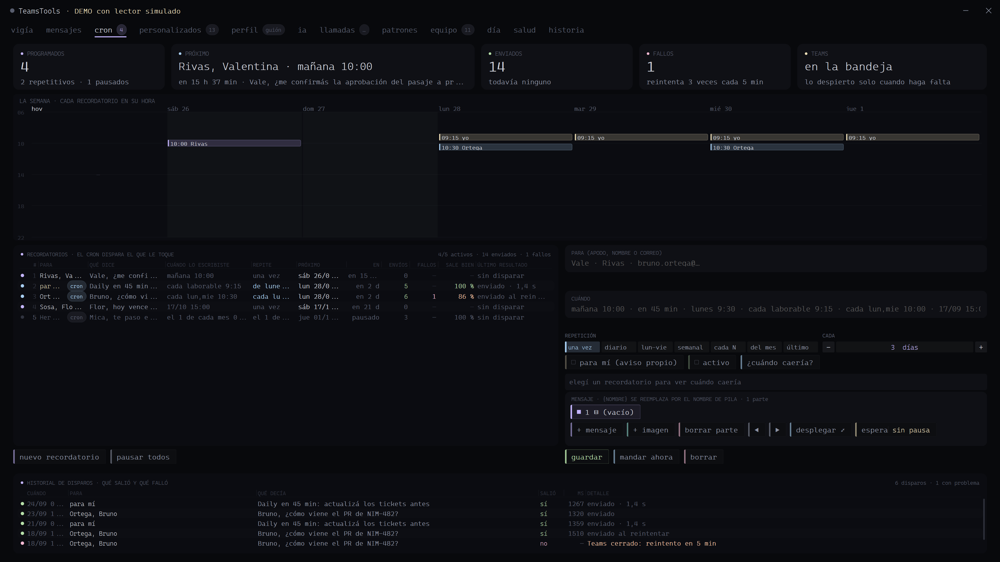

<p align="center">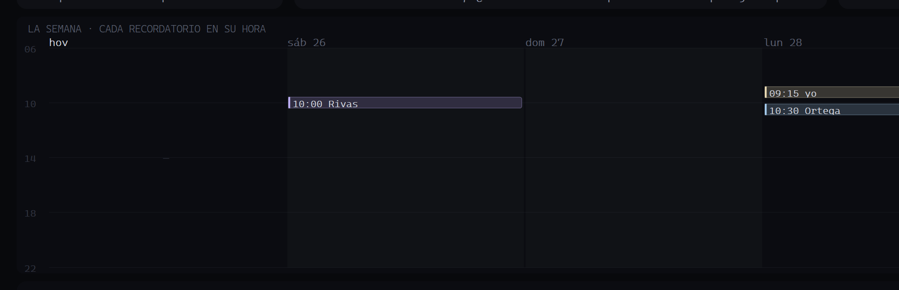<br><sub>La semana: cada recordatorio en su hora, con el día de hoy primero; crema = para mí, cielo = recurrente, malva = una vez.</sub></p>

<p align="center">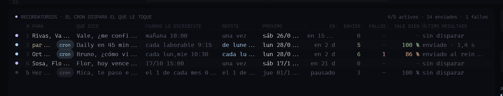<br><sub>Los recordatorios: a quién, qué dice, cómo lo escribiste, cómo repite, cuándo cae, envíos, fallos y qué porcentaje salió bien.</sub></p>

<p align="center">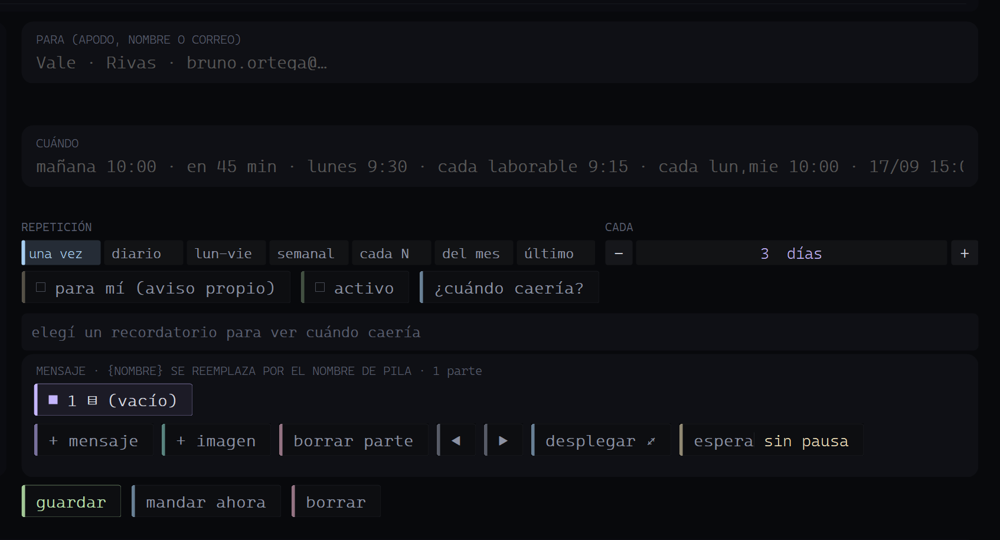<br><sub>El editor: destinatario con sugerencias de la agenda, el «cuándo» en lenguaje natural con su lectura, la repetición (una vez, diario, lun-vie, semanal, cada N, del mes, último), «para mí» y la vista de cuándo caería.</sub></p>

### personalizados · mensajes de un clic y la agenda

Mensajes tuyos guardados con etiqueta, formato y destinatario sugerido, con la **vista previa** de cómo le llega al otro. Abajo, el equipo como lo ve la lista de chats de Teams: presencia en vivo, cuánto hace, cuántos cambios, cuánto estuvo Disponible; y los movimientos: quién se conectó y se desconectó.

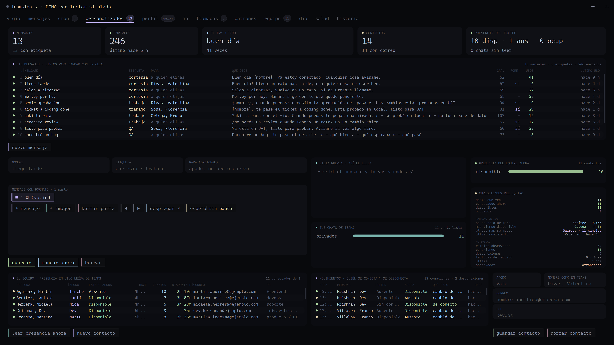

<p align="center">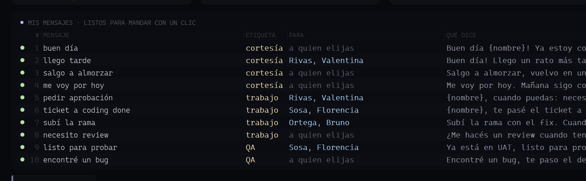<br><sub>Mis mensajes: nombre, etiqueta, para quién, qué dice, caracteres, si lleva formato, usos y último uso.</sub></p>

<p align="center">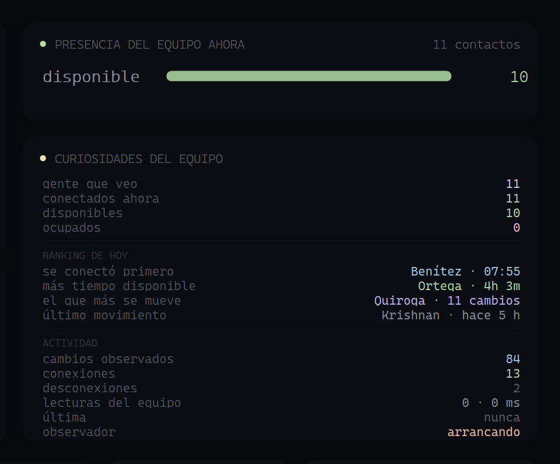<br><sub>La presencia del equipo ahora y las curiosidades del día: quién se conectó primero, quién estuvo más disponible, quién se mueve más.</sub></p>

<p align="center">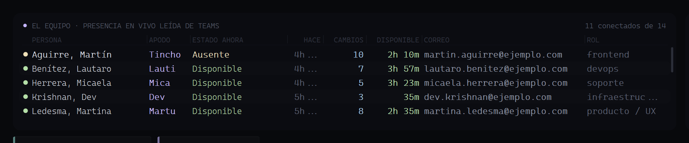<br><sub>El equipo leído de Teams: estado ahora, hace cuánto, cambios, tiempo disponible, correo y rol. Doble clic pone «para».</sub></p>

### perfil · el guión de presencia

Una lista de tramos que se repite en bucle («Disponible 90 min ± 20 %, Ausente 6 min ± 50 %, Disponible 75, Ocupado 30…») para que tu estado parezca de una persona y no de un proceso. Plantillas *más real*, *jornada*, *foco* y *siempre online*. Respeta el horario laboral, lo que pongas a mano, y puede desconectarte al salir del horario. El estado se fija desde el menú del avatar de Teams **sin abrir ninguna ventana**.

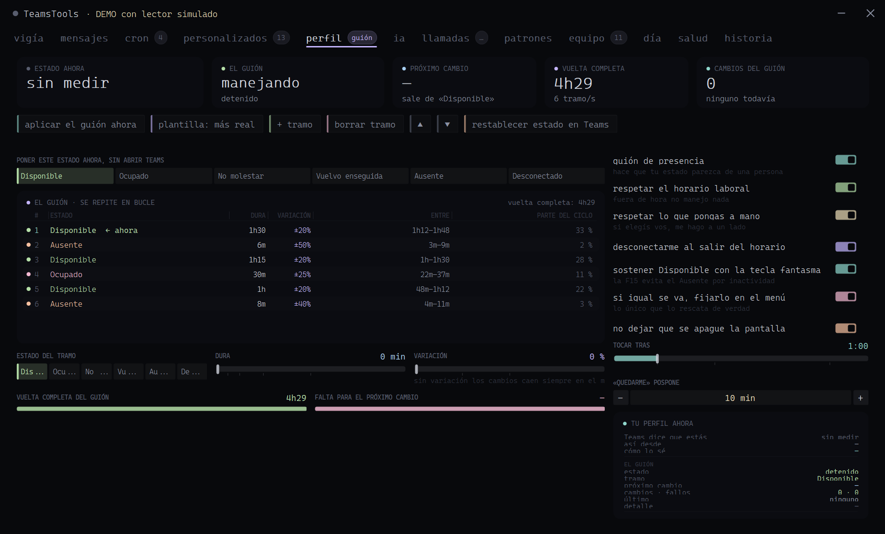

<p align="center">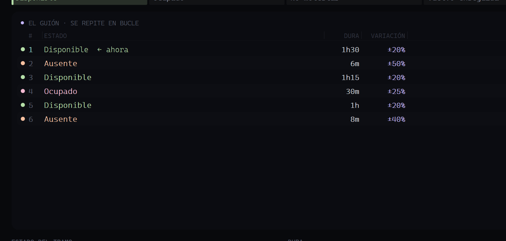<br><sub>El guión: poner un estado ahora sin abrir Teams, y los tramos con su duración, variación, rango real y parte del ciclo.</sub></p>

<p align="center">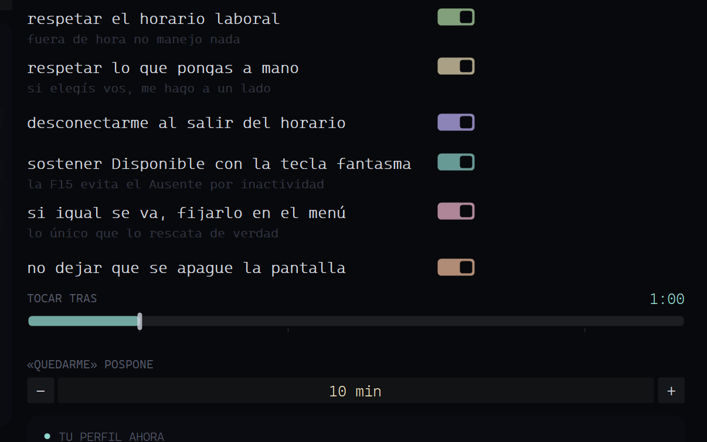<br><sub>Los interruptores: guión, horario, respetar lo manual, desconectarse al salir, la tecla fantasma, el rescate desde el menú y no dejar que se apague la pantalla.</sub></p>

### ia · micromodelos sobre tus conversaciones

Ocho lectores de avisos y tres de notas, todos **locales y deterministas** (búsquedas y reglas, sin modelo): *te deben respuesta*, *te esperan*, *vencimientos*, *producción*, *te nombraron*, *tickets*, *tema caliente*, *conversación fría*; y la libreta: *me comprometí*, *me prometieron*, *se decidió*. Corren sobre los últimos N días en cientos de milisegundos. El modelo local sólo entra si le pedís un resumen.

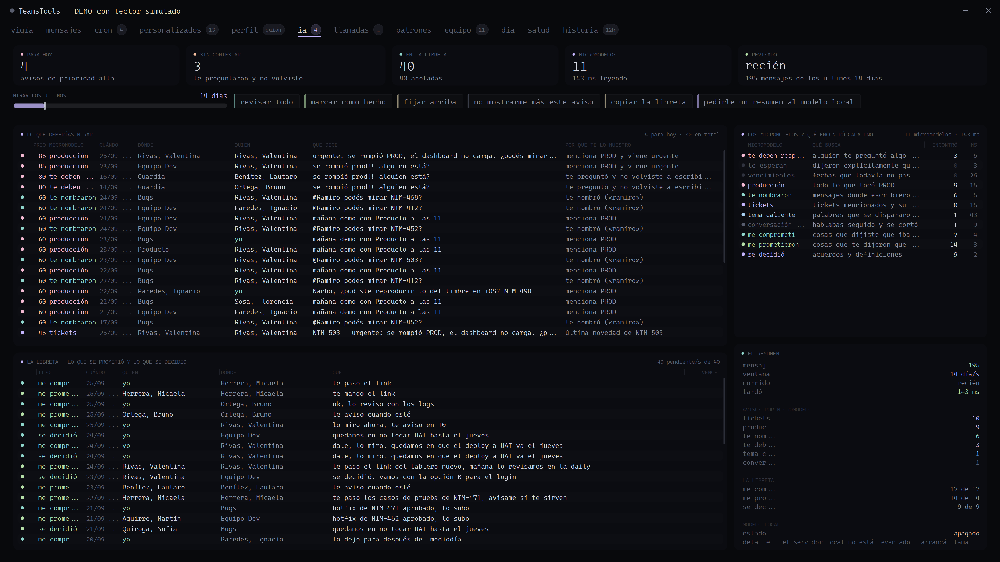

<p align="center">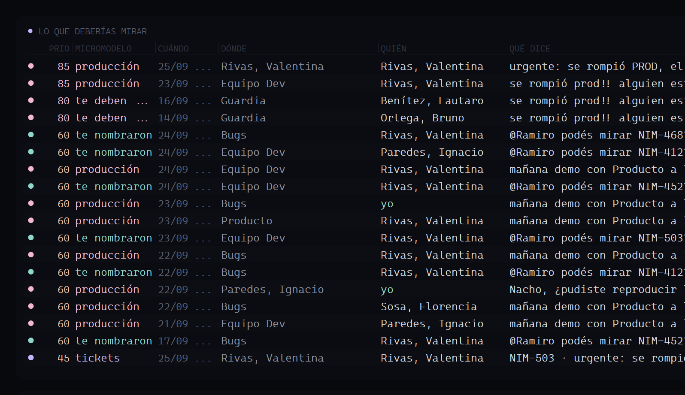<br><sub>Lo que deberías mirar: prioridad, qué micromodelo lo vio, cuándo, dónde, quién, qué dice y por qué te lo muestra.</sub></p>

<p align="center">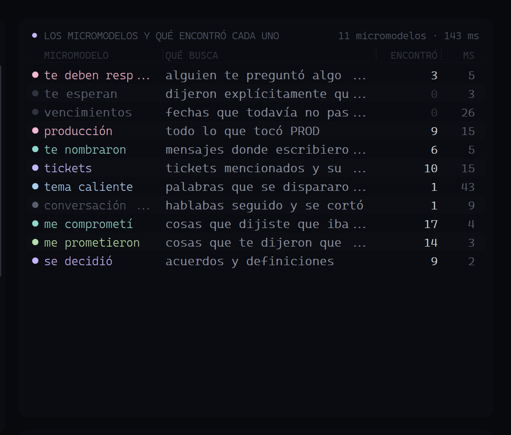<br><sub>Cada micromodelo, qué busca, cuánto encontró y cuánto tardó (todos juntos, decenas de milisegundos).</sub></p>

<p align="center">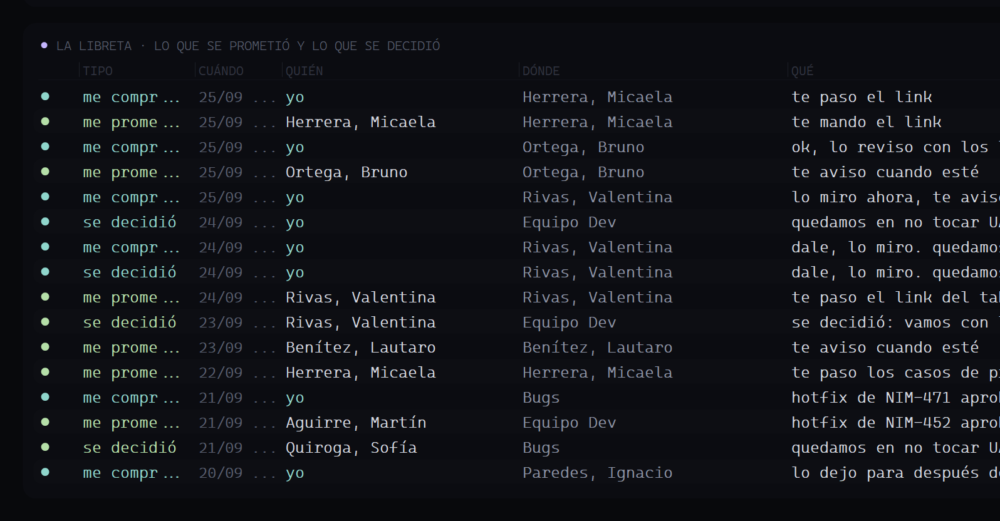<br><sub>La libreta: lo que te comprometiste, lo que te prometieron y lo que se decidió, con quién, dónde y cuándo vence.</sub></p>

### llamadas · el grabador

La banda en vivo mientras se graba: el punto que late, el reloj, dos cintas que corren (**llamada** en cian, **tu mic** en malva) con «entrando», el nivel en dB con su pico, por dónde suena y por dónde entra («suena por JBL TUNE FLEX (recién conectado)»), «silenciado en Teams · lo que digas ahora no se graba», y la salud de loopcap con los MB y el disco libre. Abajo, la lista de reuniones grabadas con su estado (grabando, en cola, archivando 40 %, transcribiendo, lista, falló), el **recorrido** paso a paso de la elegida con su bitácora, el resumen y el visor de la transcripción.

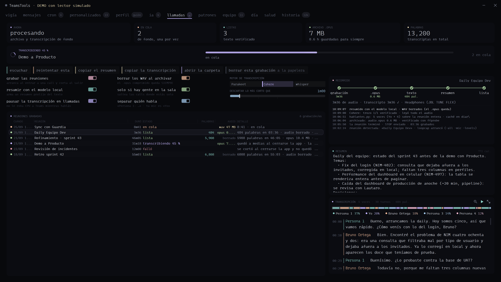

<p align="center">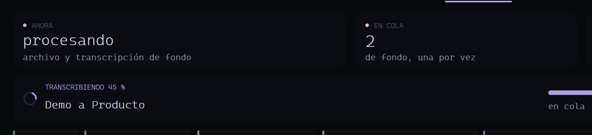<br><sub>Ahora, en cola, y la banda de lo que se está procesando (acá: transcribiendo al 45 %).</sub></p>

<p align="center">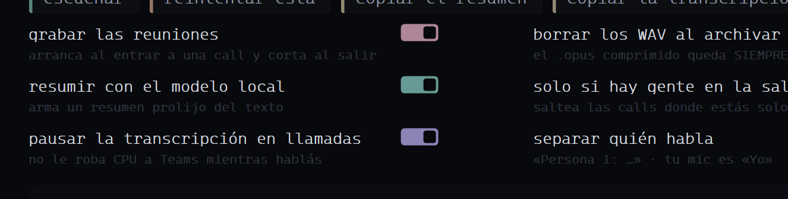<br><sub>Los ajustes: grabar, borrar los WAV al archivar (el .opus queda siempre), resumir, sólo con gente, pausar en llamadas, separar quién habla, el motor y el descarte de lo más corto.</sub></p>

<p align="center">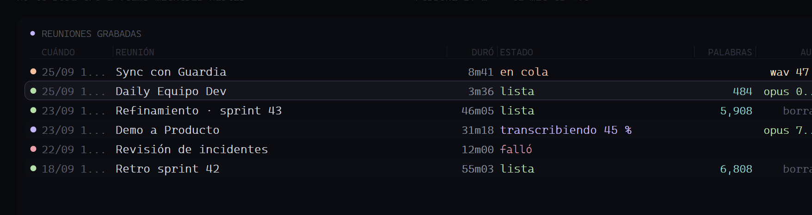<br><sub>Las reuniones grabadas: cuándo, cuánto duró, en qué estado está (en cola, lista, transcribiendo 45 %, falló), palabras, qué audio queda y el detalle.</sub></p>

<p align="center">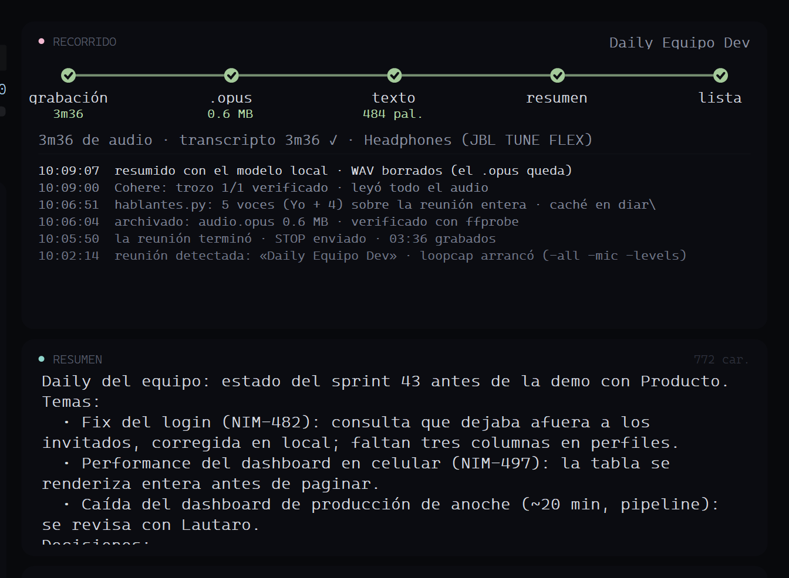<br><sub>El recorrido de la elegida (grabación → .opus → texto → resumen → lista) con la bitácora hora por hora, y el resumen que armó el modelo local.</sub></p>

<p align="center">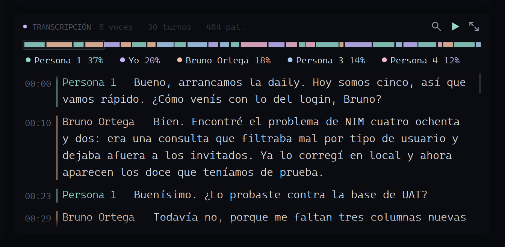<br><sub>La transcripción en su lugar de la pestaña: cinta, leyenda de voces y los turnos con su hora.</sub></p>

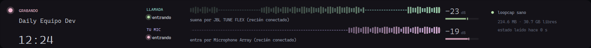

<p align="center"><sub>La banda en vivo mientras se graba (dibujada con un pulso sintético): las dos cintas que corren, el nivel con su pico, por dónde suena y la salud de loopcap.</sub></p>

<p align="center"> &nbsp; <br><sub>El REC de la barra de título se ve desde cualquier pestaña, con dos vúmetros finitos; a la derecha, con el micrófono silenciado en Teams.</sub></p>

### la transcripción, en grande

Cada voz con su color, la **cinta** con un carril por voz y el eje de tiempo, la columna «quién habló» con porcentaje, minutos y turnos, y el **karaoke**: el turno que suena se enciende, lo dicho se ilumina al ritmo del audio y la vista lo sigue sola.

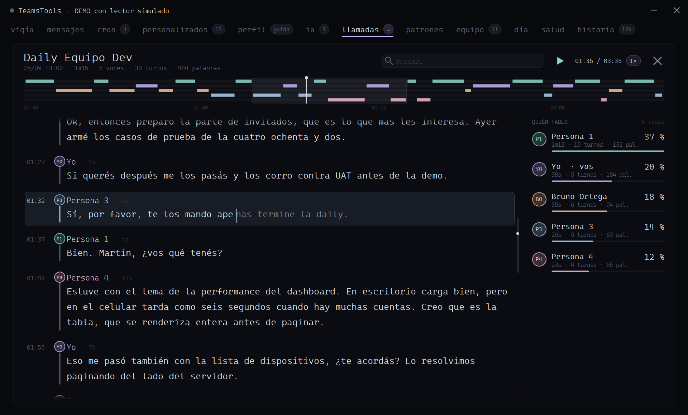

<p align="center">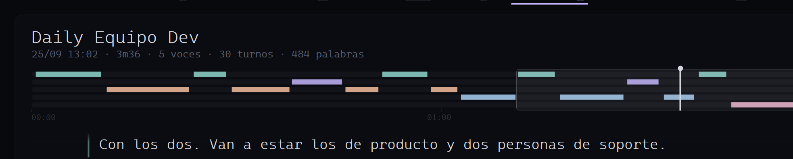<br><sub>La cinta: un carril por voz, el eje de tiempo, el recuadro de lo que se ve y el cabezal del audio. Clic o arrastre = ir ahí.</sub></p>

<p align="center">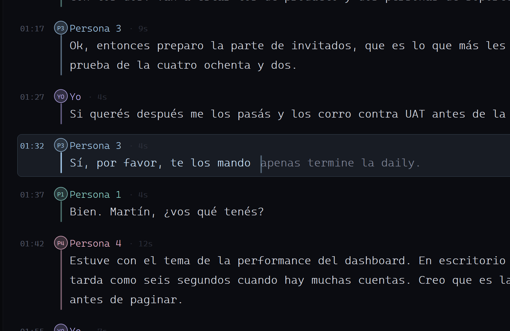<br><sub>Los turnos: hora (clic = escuchar desde ahí), avatar y nombre con el color de la voz, y el karaoke iluminando lo que ya sonó.</sub></p>

<p align="center">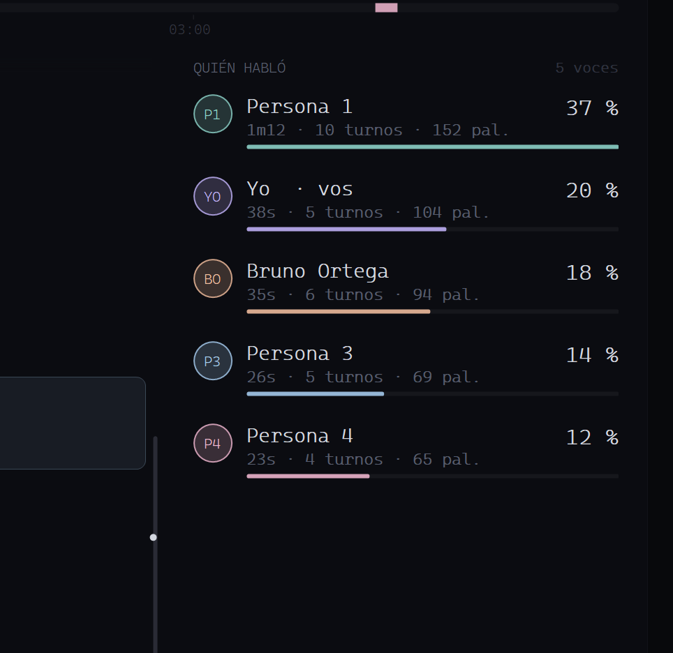<br><sub>Quién habló: porcentaje, minutos, turnos y palabras por voz, la barra relativa a la que más habló, y las sugerencias del detective con su porqué.</sub></p>

<p align="center">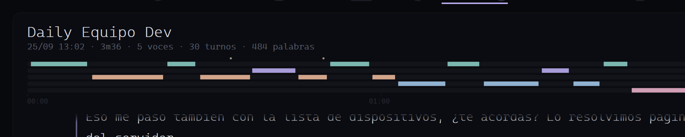<br><sub>Buscar es escribir: sin tildes ni mayúsculas, la ñ importa; las apariciones se marcan en el texto, en la cinta y en la barra.</sub></p>

<p align="center">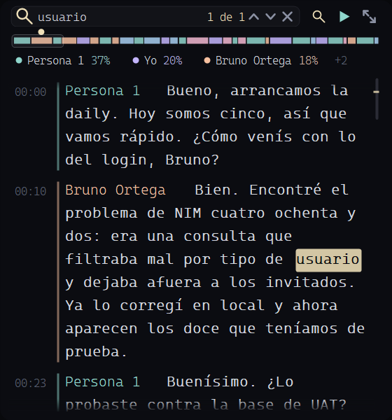<br><sub>El visor compacto, con una búsqueda: la misma conversación en el rincón de la pestaña.</sub></p>

### patrones · lo raro y quién está con quién

Hallazgos con peso: parpadeo (4 cambios en 10 minutos), tramos de 6 horas sin moverse, actividad de madrugada, días con el doble de cambios que tu mediana, exceso de Ausente, tu hora más inestable; y del equipo: el primero en llegar, el último en irse, el más inquieto, quien no dio señales, el «relojito» que se desconecta siempre a la misma hora. La tabla **quién está en call con quién** cruza tres fuentes (más abajo se explica) y dice cómo lo sabe.

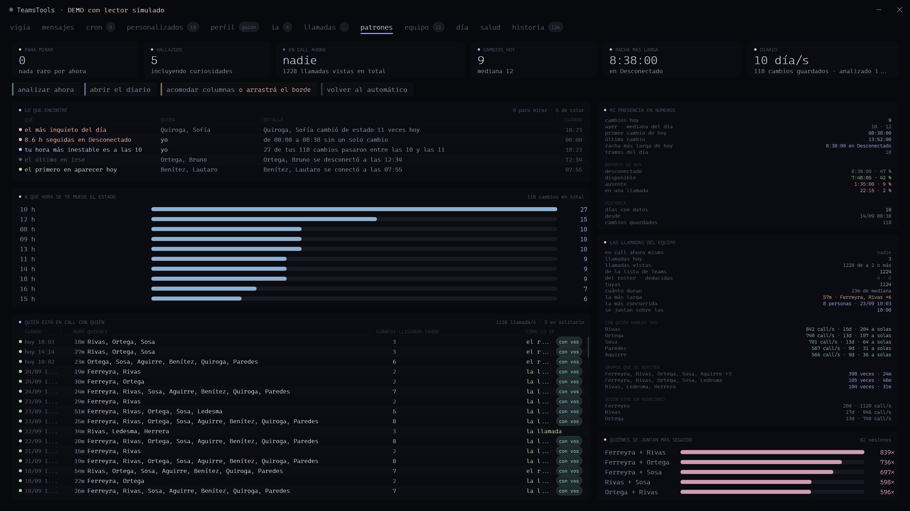

<p align="center">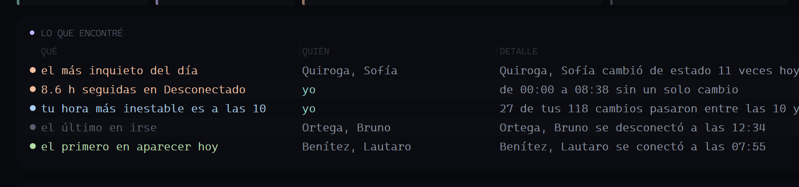<br><sub>Lo que encontré: qué, quién, el detalle con los números y cuándo. Debajo, en la captura completa, a qué hora del día se te mueve el estado.</sub></p>

<p align="center">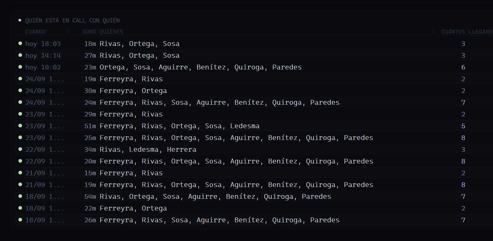<br><sub>Quién está en call con quién: cuándo, cuánto duró, quiénes, cuántos, quién llegó tarde y cómo lo sé (la llamada del historial, el roster de Teams o deducido de la presencia), con la insignia «con vos».</sub></p>

<p align="center">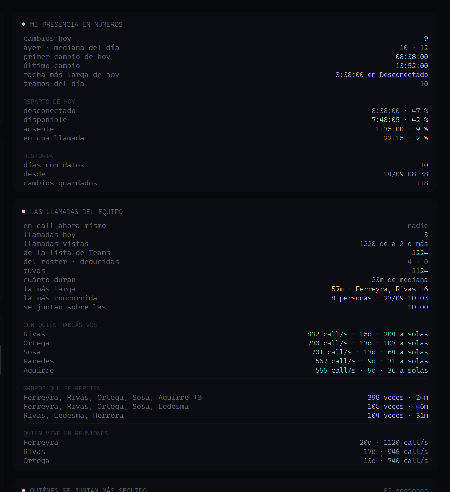<br><sub>Mi presencia en números (cambios, rachas, reparto de hoy, historia) y las llamadas del equipo (cuántas, cuánto duran, la más larga, la más concurrida, a qué hora se juntan).</sub></p>

<p align="center">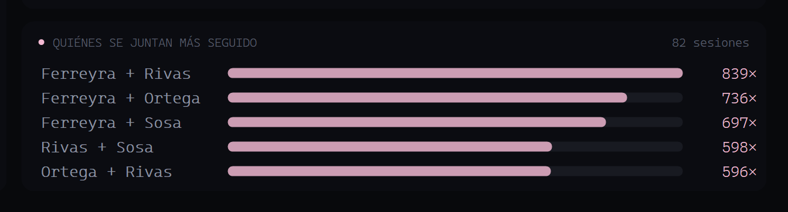<br><sub>Las parejas que más coinciden en llamadas, contadas sobre las sesiones vistas.</sub></p>

### equipo · cuatro lentes

**ahora** (la lista de chats en vivo), **historia** (lo que se escribieron en privado desde siempre: quién habla más, días juntos, silencio, la pelota), **esperas** (medianas de cuánto te hacen esperar y cuánto los hacés esperar vos, quién arranca) y **ritmo** (hora pico, su franja horaria en un sparkline de 24 horas, mensajes por día, palabras por mensaje).

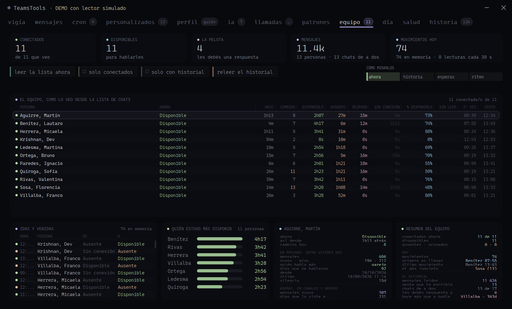

<p align="center"><br><sub>La lente «ahora»: estado, hace cuánto, cambios, minutos en cada estado, % disponible, sin leer, primera vez y última vez.</sub></p>

<p align="center"><br><sub>La ficha de la persona elegida: ahora, en privado entre ustedes dos, además en canales y grupos, quién espera a quién, la pelota y lo último que dijo.</sub></p>


<p align="center"><sub>La lente «historia»: lo que se escribieron en privado desde siempre, quién habla más, días juntos, silencio y la pelota (a quién le debés respuesta).</sub></p>


<p align="center"><br><sub>La lente «esperas»: cuánto espera él, cuánto esperás vos, la balanza, la reacción de cada lado, los turnos y quién arranca. Medianas, no promedios.</sub></p>

<p align="center"><br><sub>El ranking de la lente: quién te hace esperar más.</sub></p>


<p align="center"><br><sub>La lente «ritmo»: hora pico, la franja horaria de cada uno en un sparkline de 24 horas, días activo, mensajes por día, palabras por mensaje, primero, último y silencio.</sub></p>

### día · tu presencia hora por hora

Una banda por día, 24 celdas, el color del estado dominante de esa hora y el porcentaje de Disponible al costado. Los tramos de hoy y los cambios por día.


<p align="center"><br><sub>El mapa: cada fila un día, cada celda una hora (verde Disponible, gris Ausente, durazno en una llamada, vacío desconectado), y el % del día a la derecha.</sub></p>

<p align="center"><br><sub>Los tramos de hoy: desde, hasta, estado, duración y parte del día.</sub></p>

<p align="center"><br><sub>Días comparados: cuántos cambios de estado tuvo cada día.</sub></p>

### salud · diez chequeos con evidencia

Cada chequeo dice qué miró, si está bien, la evidencia y cuánto tardó: Teams corriendo, el log nativo, el avatar por UIA, el reloj de inactividad, la sesión, el disco, la coherencia entre el log y el avatar, la permanencia online, los micromodelos y el modelo local (que es opcional a propósito).


<p align="center"><br><sub>Los chequeos: qué miro, el resultado (bien, ojo, mal), la evidencia concreta y los milisegundos.</sub></p>

<p align="center"><br><sub>El entorno: Teams, la ventana de chat, la presencia medida (fuente, frescura, estado, toques, derivas, forzados) y el log nativo.</sub></p>

### historia · buscar en todo lo que escribiste

Varias palabras (todas tienen que estar), por conversación, por autor, por rango, sólo los tuyos, con o sin altas y llamadas. Cada resultado trae las señales de los micromodelos y su prioridad; el elegido las explica una por una.


<p align="center"><br><sub>Los resultados: fecha, conversación, autor («yo» en cian), el mensaje, las señales y la prioridad.</sub></p>

<p align="center"><br><sub>El corpus: cuántos mensajes, con texto, míos y de otros, conversaciones, personas, desde, hasta, por año; y dónde se habla más.</sub></p>

---

## Cómo lo hace

### Lee Teams por accesibilidad, con la ventana minimizada

Teams nuevo es una app web (`ms-teams.exe`, ventanas de clase `TeamsWebView`). Su árbol de **UI Automation** está entero aunque la ventana esté minimizada, así que la app no necesita verla. Los puntos fijos no dependen del idioma:

| Qué | Dónde |
|---|---|
| el documento | `AutomationId = RootWebArea` (todo se acota a este nodo) |
| el botón de colgar | `Button hangup-button` → `InvokePattern.Invoke()` cuelga la reunión con la ventana minimizada |
| el reloj de la reunión | `Text call-duration-custom` → el hijo con el valor vivo |
| los participantes | un `MenuItem` por persona en la galería; la ficha propia es una `Image` «Vídeo de mí mismo, Apellido, Nombre, …» (de ahí la app **aprende tu nombre**) |
| el panel Gente | `Button roster-button` → `Group roster-title-section-N` «En esta reunión, 12 en total» |
| la lista de chats | `Tree "Teams"` → `TreeItem "Mensaje sin leer Chat Apellido, Nombre Ausente"` (se parsea prefijo, tipo, nombre y presencia) |
| el editor y el botón enviar | `Edit new-message-*` y `Button "Enviar (Ctrl+Enter)"` |
| tu avatar | `Button idna-me-control-avatar-trigger` «Tu perfil, estado Disponible» (para leer) → `ExpandCollapsePattern` (para cambiarlo) |

Toda lectura corre **fuera del hilo de la interfaz**, y todo acceso de fondo a Teams pasa por una **aduana** (`TeamsGate`, un único `Monitor` reentrante): el observador, el autocontestador, la presencia, el cron y el guión no pueden pisarse. Antes de eso, tres hilos tocaban las mismas ventanas a destiempo y un envío moría con `COMException` dejando el texto a medias.

Detalle completo en [docs/como-lee-teams.md](docs/como-lee-teams.md).

### La tecla fantasma F15 y el rescate del Ausente

Para que Teams no te marque Ausente hay que reiniciar el reloj de inactividad del sistema, y desde modo usuario no hay ninguna API para falsearlo sin inyectar un evento de entrada. La opción limpia no es el mouse: es **F15**, una tecla del estándar HID que ningún teclado físico tiene y ninguna aplicación mapea. Un `SendInput` de F15 reinicia el reloj sin mover el cursor ni escribir nada (medido: inactividad de 24.688 ms → 156 ms).

Pero la F15 **evita** el Ausente y **no lo rescata**: medido durante horas, con Teams dormido en la bandeja el estado se va a Ausente y ningún pulso lo trae de vuelta. Lo que sí lo trae es el **menú del avatar**, que expone `ExpandCollapsePattern`: se abre desde UIA puro, se elige «Disponible» (son `RadioButton`, no `MenuItem`) y se cierra en un `finally`, sin una sola tecla y sin mostrar nada. La presencia se mide en tres capas de la más delicada a la más invasiva (**log nativo → avatar por UIA → sonda profunda**), corrige sólo el Ausente automático tras dos lecturas seguidas, y si en 4 intentos Teams vuelve a Ausente igual, **se rinde 15 minutos y lo dice** en vez de martillar en silencio.

Cómo distingue tu Ausente manual del automático: la app sabe exactamente cuándo inyecta su F15, así que **un reinicio del reloj de inactividad que no es suyo es el usuario de verdad**. Si Teams pasó a Ausente con vos usando la máquina en los últimos 3 minutos, lo puso alguien: se respeta 10 minutos antes de re-evaluar.

### La presencia real sale del log nativo de Teams

`%LOCALAPPDATA%\Packages\MSTeams_8wekyb3d8bbwe\LocalCache\Microsoft\MSTeams\Logs\MSTeams_*.log`. No abre ventanas, no monta UIA: sólo lee un archivo que Teams ya escribe. Dos renglones se complementan: `UserPresenceAction: {…, availability: Away}` (lo que la nube dice de vos) y `SetBadge Setting badge: GlyphBadge{"away"}, …, estado Ausente` (lo que la app pinta, con el nombre traducido).

> [!CAUTION]
> El huso de ese log **miente**: la marca dice `03:50:33-03:00` pero ocurrió a las 00:50:33 locales. Los dígitos son UTC y el offset es decorativo. El lector parsea el instante como UTC e ignora el offset escrito. Y hay que abrir el archivo con `FileShare.ReadWrite | Delete`, o Teams lo tiene tomado.

### Mensajes 100 % invisibles

| Paso | Cómo |
|---|---|
| encontrar el chat | `Tree "Teams"` → `TreeItem` → `SelectionItemPattern.Select()`: sin foco, sin ventana |
| Teams en la bandeja | la ventana oculta **conserva su árbol**: `ShowWindow(SW_SHOWMINNOACTIVE)` la deja usable (sale en la barra de tareas, **nunca en pantalla**) y `SW_HIDE` la vuelve a esconder. Fuera de pantalla no sirve: Chromium no renderiza off-screen y no monta el editor |
| escribir texto plano | `WM_CHAR` posteado al `Chrome_RenderWidgetHostHWND` con la ventana minimizada; se verifica por `ValuePattern` que entró completo antes de enviar, y se confirma que el editor quedó vacío antes de reintentar (nunca duplica) |
| escribir con formato | atajos reales por `SendInput`: Ctrl+B/I/U, Ctrl+Alt+X, listas Ctrl+Shift+8/7, cita Ctrl+Alt+4, código Ctrl+Shift+B, **Shift+Enter** entre líneas; el texto va como Unicode (acentos, ñ, emoji) |
| imágenes | portapapeles con `PNG` + `CF_BITMAP` y Ctrl+V; cada parte de un envío es su propia burbuja |
| enviar | `Invoke` en «Enviar» |
| devolver el foco | Teams suelta el foreground y vuelve a tu ventana; si Windows se lo niega (la F15 cuenta como input reciente), `AttachThreadInput` + `BringWindowToTop` |

Verificado con `diag\prueba-invisible.ps1`: oculta las ventanas de Teams, manda un mensaje con formato y muestrea la pantalla cada 150 ms → **máximo 0 ventanas de Teams visibles** y el foco de vuelta.

### Quién estuvo en llamada con quién

Teams dice «En una llamada» pero no con quién. Tres fuentes, de la más confiable a la menos:

| fuente | qué es |
|---|---|
| **la llamada** | cada `Event/Call` del historial trae un `<partlist>` con la lista exacta de participantes y su duración (el extractor lo rescata) |
| **el roster** | cuando vos estás en la reunión, el panel de Teams da los nombres: se anota uno por minuto en `corrillos.jsonl` |
| **deducido** | dos personas que entran a una llamada con menos de 15 minutos de diferencia y cuyos tramos se **contienen** al menos un 70 % estaban en la misma; se unen por transitividad con **union-find**; un corte de menos de 2 minutos es una reconexión, no dos llamadas; la confianza es la **mediana** de las contenciones de a pares (con el mínimo, uno que llegaba tarde hundía la reunión entera) |

Lo confirmado pisa a lo deducido cuando se superponen. Con eso salen los compañeros con los que más hablás, las parejas que más coinciden, los **grupos que se repiten** (una reunión semanal detectada sin mirar ningún calendario) y quién vive en reuniones.

### El historial entero, sin abrir Teams

Los chats están en el IndexedDB local de Teams (LevelDB + snappy + serialización de V8). `tools\teams-chats` es un extractor en **Python puro, sin ninguna dependencia**: lee las SSTables y el WAL, descomprime snappy a mano, decodifica el esquema de IndexedDB de Chromium y el formato de V8, junta perfiles, conversaciones y mensajes, y deja `mensajes.jsonl`. Se copia la base a `%TEMP%` primero: no hace falta cerrar Teams.

Sobre eso, `equipo` calcula **esperas y reacciones** por turnos (corridas del mismo lado, cortadas por huecos de más de 4 horas) con **medianas** (un mensaje contestado al otro día arruina cualquier promedio) y un tope de 24 horas; sólo en conversaciones de a dos, porque en un grupo «el que habló después» no te estaba contestando.

### La interfaz nunca se tilda


```mermaid
flowchart LR
    T[Teams · UIA] -->|hilo sondeo| F1[foto inmutable]
    G[grabador · actor] -->|250 ms| F2[foto inmutable]
    L[log nativo] -->|hilo presencia| F3[foto inmutable]
    H[historial · jsonl] -->|ThreadPool| F4[foto inmutable]
    F1 & F2 & F3 & F4 -->|Volatile.Read| UI[hilo de la interfaz · sólo pinta]
    UI -->|encola| D[Disco · escritura diferida y atómica]
    UI -.-> S[LatidoUi · sismógrafo cada 100 ms]
```

- `Disco`: toda escritura (config, índices, logs, jsonl) es diferida, coalescida en ventanas de 60 ms y atómica (`.tmp` + `File.Replace`), con reintentos exponenciales si el antivirus la traba. Treinta clics en un chip son una escritura.
- `Sondeo<T>`: procesos y ventanas de Teams se miden en un hilo propio cada 2 s.
- `LatidoUi`: manda un `BeginInvoke` vacío cada 100 ms y mide cuánto tarda en atenderse; una traba de más de 250 ms se atribuye a su culpable (`Migas`) y sale en `estado.json` con p50, p99 y máximo. Medido con ffmpeg y dos transcripciones de fondo: **p50 0,3 ms · p99 11,5 ms · máx 31,6 ms · 0 trabas**.
- `Tareas`: registro central de lo que está pasando; la línea finita bajo la barra de título se enciende con cualquier trabajo de fondo, las tablas muestran esqueletos con destello mientras esperan su dato y los chips laten mientras su acción corre.

---

## El grabador de llamadas


```mermaid
flowchart LR
    A[llamada detectada<br/>ventana o presencia] --> B[loopcap 3<br/>todas las salidas + tu mic<br/>una pista por dispositivo]
    B --> C[corte<br/>gracia 90 s · 8 s si tu presencia<br/>confirma que saliste]
    C --> D[encabezados honestos<br/>energía por pista]
    D --> E[UNA pasada de ffmpeg<br/>audio.opus + 16 kHz<br/>mic silenciado en Teams = volumen 0]
    E --> F[ffprobe verifica<br/>recién ahí se renombra]
    F --> G[hablantes.py<br/>quién habla, la reunión entera]
    G --> H[trozos de ~10 min<br/>cortados en un cambio de turno<br/>reanudables]
    H --> I[Cohere / Parakeet / whisper<br/>pausado si estás en una llamada]
    I --> J{¿leyó TODO?}
    J -->|sí| K[resumen con el modelo local]
    J -->|no| X[falló · el audio sigue intacto]
    K --> L[lista · recién ahora<br/>se borran los WAV]
```

Lo que garantiza, y por qué cada garantía existe (cada una es una reunión que se perdió antes de tenerla):

| Garantía | Cómo |
|---|---|
| loopcap nunca se traba | su consola jamás bloquea (cola con descarte) y el grabador drena stdout y stderr siempre. Sin eso, a los 21 s el caño se llenaba, loopcap se congelaba y el WAV quedaba declarando 21 s de 26 min |
| un disco lleno no mata la grabación | un escritor-actor por pista: la captura nunca toca el disco, lo que no entra espera en cola (48 MB) con backoff de 50 ms a 2 s, y al volver el espacio se rellena con **silencio del largo perdido** para no correr el reloj |
| el encabezado dice la verdad | se reescribe cada segundo con lo que hay de verdad en disco, y el pipeline lo repara igual antes de procesar |
| nada se transcribe a medias | el transcriptor dice cuánto audio ve **antes** de gastar CPU; si ve menos que lo esperado, se aborta; al final el `.json` lo confirma |
| nada se borra sin verificar | los WAV se van sólo con el `.opus` verificado por ffprobe y la transcripción verificada. Descartes y borrados van a `_papelera` 7 días |
| loopcap nunca queda huérfano | `-parent <pid>`: si la app muere, loopcap corta solo. Un loopcap huérfano de una prueba llenó un disco una vez |
| si loopcap muere o se traba | el vigía lo nota en 25 s y retoma en un **tramo** nuevo (backoff 1, 2, 4, 8 s); al final los tramos se concatenan alineados |
| los auriculares que se conectan a mitad de la llamada | loopcap 3 sigue los dispositivos **por eventos** de Windows: uno nuevo se suma a su propia pista alineada al reloj de la grabación (lo anterior va como silencio); uno que se va y vuelve sigue en su pista |
| tu micrófono, sin lo que no salió | `-mic` graba el micrófono que esté usando la llamada; un vigía lee el botón de micrófono de Teams 3 veces por segundo y, al archivar, lo que captó en silencio **no entra a la mezcla** |
| ninguna pista buena se descarta | la energía se muestrea (100 ms cada 2 s), así que un micrófono con dos frases en media hora salía «mudo»: manda el **pico exacto** que loopcap anotó sobre todos los paquetes |
| una transcripción larga no se pierde | trozos de ~10 min cortados en un cambio de turno (o en el punto más callado); cada trozo verificado queda guardado y un reinicio retoma desde ahí |
| Teams no pierde CPU | la transcripción se congela (`NtSuspendProcess`) mientras estás en una llamada y corre a prioridad baja; ffmpeg y python van en un **Job Object** y mueren con la app |
| todo atómico | ffmpeg escribe `audio.tmp.opus` y `audio16.tmp.wav`; se renombran recién verificados. Al reabrir la app, cada grabación retoma en el punto verificado más avanzado |

### loopcap 3

`tools\loopcap` es el motor de captura, en Go, sin drivers virtuales ni dependencias: COM directo contra WASAPI. Graba lo que **sale** por los parlantes (loopback) y lo que **entra** por el micrófono que esté usando otro programa. Un escritor-actor por pista, la consola que nunca bloquea, un vigía de dispositivos por eventos con debounce de 40 ms y una ronda de seguridad cada 5 s, alineación exacta por QPC (cada paquete trae el instante en que se capturó), un estado JSON honesto cada segundo (`audio_seconds`, `lost_seconds`, `write_error`, `disk_free_mb`, `kept`) y un **pulso** por stdout 20 veces por segundo (`LV` niveles, `DEV` dispositivos que se suman, vuelven, esperan o se van) con el que la app dibuja las cintas en vivo.

```
loopcap -o salida.wav -all -mic -levels     todas las salidas, tu mic, el pulso
loopcap -o salida.wav -stop x.flag           corta limpio cuando aparece ese archivo
loopcap -o salida.wav -parent 1234           corta solo si muere el proceso que lo lanzó
loopcap -probe 10                            medidor en vivo: por dónde está sonando
loopcap -list                                salidas y micrófonos, con quién los usa
```

16 pruebas (`go test`): disco lleno un rato, cola desbordada, escritor trabado, escrituras parciales, silencio en su lugar, consola con el caño lleno, dispositivo nuevo a mitad, el que vuelve, el mic que se suelta, formato nuevo a pista nueva, nombres repetidos.

### Transcripción: motores locales

`tools\transcribe` trae dos transcriptores con el mismo contrato (`transcribe.py` con faster-whisper, `transcribe_sherpa.py` con sherpa-onnx) y `hablantes.py` para separar quién habla. Medidos contra una daily rioplatense de **verdad conocida** (557 palabras, 4 voces neuronales, jerga, respuestas cortas que se pisan; `banco_verdad.py` la sintetiza):

| motor | audio limpio | como Teams | condición dura | voz baja comida (dura) | velocidad |
|---|---|---|---|---|---|
| **Cohere Transcribe 2B** (por defecto) | 3,8 % | 3,0 % | **6,8 %** | **6 %** | ~0,5× tiempo real |
| whisper large-v3 (rápido) | **2,9 %** | **2,3 %** | 11,1 % | 26 % | 1,5–20× (compartiendo CPU) |
| Parakeet TDT 0.6B | 3,8 % | 4,1 % | 11,1 % | 7 % | ~0,2× |
| Qwen3-ASR 0.6B | 5,6 % | 6,3 % | 16,0 % | 30 % | ~0,8× |
| FastConformer castellano | 9,3 % | 10,6 % | 28,2 % | 83 % | ~0,07× |

(WER = palabras mal + comidas + sobrantes, sobre las palabras dichas.) Con audio fácil whisper es apenas mejor; con audio difícil **se come cuatro veces más** (su detector de voz tira a la persona que habla bajo) y es mucho más lento. Por eso los motores sherpa no usan VAD: el audio se corta en tramos de hasta 20 s en el marco más callado y se transcribe el 100 %, con una **compuerta de voz** (un tramo sin 100 ms seguidos 10 dB sobre el piso no se le da al motor: evita los «Thank you.» inventados).

**Quién habla**: `hablantes.py` diariza la reunión **entera** una vez (pyannote-segmentation-3 + huellas ERes2Net + enlace promedio 0,22, elegido con el banco: 4 de 4 personas) y guarda lo caro en `diar\`. **«Yo» sale de tu micrófono, no se adivina**: tus turnos son donde el mic está 15 dB sobre su piso y a la par de la salida (el eco llega mucho más bajo), y la diarización corre sobre la salida, donde sólo están los demás. Después Cohere transcribe turno por turno y escribe `[00:01:12] Persona 2: …`.

Detalle del pipeline, los archivos de cada grabación y los tests en [docs/grabador.md](docs/grabador.md).

---

## La transcripción como conversación

La transcripción no es un string: es una lista de **turnos** con anclas carácter↔segundo por segmento, y cada voz tiene número y color (siete pasteles curados y, de ahí en más, tonos repartidos por el ángulo dorado para que dos seguidos nunca se parezcan; «Yo» siempre malva, como «tu mic» en la banda).

| Interacción | Cómo |
|---|---|
| escuchar desde cualquier turno | clic en la hora, ▶ o Espacio; velocidad 1× · 1,25× · 1,5× · 2× sin voz de ardilla (`atempo`); ← → saltan 5 s |
| karaoke | la posición sale de **lo que ya sonó en el parlante** (`waveOutGetPosition`), no de un reloj: va clavada aunque la máquina esté cargada |
| buscar | escribir (o Ctrl+F); Enter / F3 la siguiente; marcas en el texto, la cinta y la barra de desplazamiento |
| la cinta | la reunión de un vistazo; clic o arrastre = ir ahí; en grande, un carril por voz y el eje de tiempo |
| nombres | clic derecho en una voz: la lista del panel de Teams de **esa** reunión o cualquier nombre; queda en `nombres.json` y se aplica al visor, al resumen y a «copiar la transcripción» |
| menú del turno | escuchar desde acá, copiar el turno, copiar desde acá hasta el final; doble clic copia el turno; Ctrl+C |
| ampliar | ⤢ pone el visor sobre toda la pestaña; Esc vuelve |

**El detective de nombres**: la gente se nombra al darse la palabra («…cada uno puede explorar. Sí, Vale.» → enseguida habla Persona 7), al presentarse («soy Bruno») y al contestar. Cada pista suma a un par (voz, persona del panel); hablarle a alguien o nombrarlo en tercera persona le **resta** a quien habla. Una **asignación óptima** (algoritmo húngaro, verificado contra fuerza bruta en 300 matrices) reparte los nombres sin repetir. Es prudente a propósito: sólo nombres exactos o apodos recortados en dos letras o más («Vale» → Valentina; «Julián» no es Julia ni Juliana), la evidencia ambigua se reparte, y una sugerencia sale sólo si supera el umbral y le saca margen a la segunda. Nunca se aplican solas: se muestran con su porqué.

**Liviano de verdad** (medido con una llamada en curso en una máquina de 15 W): el ajuste de línea es aritmética (Cascadia es monoespaciada: renglón = caracteres × avance), se pinta sólo lo visible (búsqueda binaria del primer turno) y un reloj propio repinta **sólo lo que cambia**: en un cuadro de karaoke, el renglón del cursor. Un cuadro de karaoke: **0,6 ms** en compacto y **0,7 ms** en grande (p50), contra 3 y 9 ms de repintar todo. La cinta quieta vive en un bitmap cacheado.

---

## Instalación y primer arranque

1. Bajá `TeamsTools.exe` del [último Release](https://github.com/agustinyarrus/teamstools/releases/latest) (o el zip portable, que trae `tools\` con loopcap y los scripts).
2. Dejalo en una carpeta donde se pueda escribir: sus datos van en `datos\`, al lado del exe (si no se puede, usa `%LOCALAPPDATA%\TeamsTools`).
3. Abrilo. Aparece el panel y el ícono en la bandeja. Entrá a una reunión: la pestaña **vigía** la ve sola.
4. Los chips de abajo son los ajustes. «inicio con Windows» escribe la entrada en `HKCU\…\Run` (reversible, sin admin).

Necesita Windows 10 u 11 de 64 bits y Teams **nuevo** (verificado con la versión 26213). .NET Framework 4.8 ya viene con el sistema. Si tenés [Cascadia Code](https://github.com/microsoft/cascadia-code) instalada se ve como en las capturas; si no, usa Consolas.

> [!NOTE]
> El exe no está firmado: la primera vez, SmartScreen puede pedir confirmación («Más información → Ejecutar de todas formas»). La app no pide permisos de administrador para nada.

> [!TIP]
> `TeamsTools.exe --demo` cuenta una historia simulada (una reunión con tres personas que se vacía) **sin tocar Teams**, para ver el vigía, el overlay y la bandeja en acción. Con `--simular`, la app avisa y cuenta, pero no sale de verdad.

---

## Qué necesita cada función

| Función | Alcanza con el exe | Además necesita |
|---|---|---|
| salir de la reunión vacía, presencia, overlay, bandeja | ✅ | — |
| autocontestador, cron, personalizados, contactos | ✅ | (opcional) `llama-server` de [llama.cpp](https://github.com/ggml-org/llama.cpp) en `127.0.0.1:8080` para las respuestas redactadas por IA |
| patrones, día, salud | ✅ | — |
| equipo, ia, historia, «quién estuvo con quién» del historial | ✅ | **Python 3** (sólo la biblioteca estándar) para el extractor de `tools\teams-chats` |
| grabar llamadas y archivarlas en `.opus` | ✅ | **`tools\loopcap\loopcap.exe`** (viene en el zip, o `go build`) y **ffmpeg + ffprobe** en el PATH |
| transcribir, separar quién habla | ✅ | **Python 3.11+** con `sherpa-onnx numpy scipy onnxruntime` (Cohere/Parakeet) o `faster-whisper` (whisper), y los modelos en `%ASR_MODELOS%`, `%DIARIZACION_MODELOS%` y `%WHISPER_MODEL_DIR%` |
| resumir la transcripción | ✅ | `llama-server` local (si no está, la reunión queda «lista (sin resumen)») |
| escuchar la grabación con karaoke | ✅ | ffmpeg |

Las herramientas se buscan en `tools\` al lado del exe; si están en otro lado, se apunta en `grabador.json` (`Loopcap`, `Transcriptor`, `TranscriptorSherpa`, `ScriptHablantes`) y en `config.json` (`carpetaExtractor`, `historialJsonl`, `carpetaLogsTeams`). Las variables de entorno se expanden.

---

## Línea de comandos

La instancia abierta se maneja desde la terminal: la segunda instancia le manda un mensaje de ventana registrado y sale.

```
TeamsTools.exe                     panel + bandeja
TeamsTools.exe --min               arranca sólo en la bandeja (es lo que pasa el arranque con Windows)
TeamsTools.exe --mostrar           abre el panel aunque «arrancar en bandeja» esté prendido
TeamsTools.exe --demo              historia simulada (no toca Teams): reunión, sala vacía, cuenta regresiva, salida
TeamsTools.exe --simular           avisa y cuenta, pero no sale de verdad
TeamsTools.exe --salir             sale de la llamada actual y termina (sin panel)
TeamsTools.exe --cerrar            cierre ORDENADO de la instancia abierta (corta la grabación limpio y vacía el disco)
TeamsTools.exe --dump              vuelca el árbol UIA de las ventanas de Teams en datos\volcados\
TeamsTools.exe --foto <pestaña> [--modo x] [--espera ms] [--ancho N --alto N] [--salida ruta.png]
                                   la app en marcha se retrata sola, sin mostrarse: la única forma honesta de
                                   revisar una pantalla con los datos de verdad adentro
TeamsTools.exe --fijar-presencia <estado>     fija el estado en el menú del avatar por UIA y espera la confirmación de la nube
TeamsTools.exe --presencia-log     vuelca la presencia real leída del log nativo (sólo lectura)
TeamsTools.exe --probar-regla <nombre>        manda la respuesta de una regla a tu PROPIO chat por el camino real
TeamsTools.exe --probar-envio [--imagen ruta] [--para "Apellido, Nombre"]   un envío de varias burbujas; sin --para va a tu chat
TeamsTools.exe --redactar "<mensaje>" [--de "Apellido, Nombre"] [--url http://…]   prueba el puente con el modelo local
TeamsTools.exe --micromodelos "<texto>"       corre los detectores sobre un texto y muestra puntaje y evidencia
TeamsTools.exe --historia "<texto>"           busca en el historial local
TeamsTools.exe --corrillos [--top N]          quién estuvo en call con quién, por las tres fuentes
TeamsTools.exe --reintentar <id>              vuelve a procesar una grabación con el motor y los ajustes de hoy
```

`--foto` acepta un `--modo` por pestaña: `equipo` → `ahora | historia | esperas | ritmo`; `llamadas` → `grabacion:<id>;amplio;sonar:150;buscar:texto;voz:Persona 2`; `mensajes` → `probar:<texto>`; `historia` → `buscar:x;conv:y;autor:z`; `ia` y `salud` → `revisar`.

Las pruebas de a bordo están en [Pruebas](#pruebas).

---

## Ajustes

### `datos\config.json`

| Clave | Default | Qué es |
|---|---|---|
| `intervaloSegundos` | 3 | cada cuánto lee la reunión |
| `graciaSegundos` | 5 | cuánto espera con la sala vacía antes de salir |
| `posponerMinutos` | 10 | cuánto pospone «Quedarme» |
| `requiereHaberVistoGente` | true | sólo sale si la sala tuvo gente y se vació |
| `salirSiNadieLlegaMinutos` | 0 | 0 = apagado; si nadie llega en N min, sale igual |
| `verificarConRoster` | true | doble chequeo con el panel Gente antes de salir |
| `metodoSalida` | uia | `uia` (Invoke, sin robar foco), `teclado` (Ctrl+Shift+H), `ambos` |
| `simulacion` | false | avisa pero no sale |
| `sonido`, `notificaciones`, `mostrarCuentaRegresiva` | true | avisos |
| `iniciarMinimizado`, `iniciarConWindows` | false | arranque |
| `escalaFuente`, `escalaUI` | 0.8 | tamaño de las fuentes y densidad de toda la interfaz (1.0 = original) |
| `presenciaSiempreOnline` | true | mantener Disponible |
| `presenciaUmbralSegundos` | 60 | segundos sin actividad antes del toque |
| `presenciaMetodo` | f15 | `f15` (tecla fantasma), `auto`, `mouse0`, `mouse1` |
| `presenciaEvitarSuspension` | true | pedirle a Windows que no apague la pantalla (dormida = Ausente) |
| `presenciaVerificarEnTeams` | true | leer el estado real y corregir si se fue a Ausente |
| `presenciaForzarEnTeams` | true | si se fue igual, fijar Disponible en el menú del avatar |
| `horarioActivo`, `horarioDesde`, `horarioHasta`, `horarioDias` | false, 09:00, 18:30, 1,2,3,4,5 | fuera del horario no sostiene presencia ni contesta |
| `atajoGlobal` | true | Ctrl+Alt+C prende y apaga el modo automático desde cualquier app |
| `miNombre`, `miCorreo` | "" | tu nombre como lo muestra Teams y tu correo; vacíos = se aprenden de tu ficha en la reunión y del contacto «yo» |
| `patronesPropio`, `patronesCompartido` | … | textos que identifican tu ficha y el contenido compartido, por idioma |
| `carpetaLogsTeams` | "" | logs nativos de Teams; vacío = la carpeta de Teams |
| `historialJsonl` | "" | el `mensajes.jsonl` del extractor; vacío = `%TEMP%\teams-extraido\mensajes.jsonl` |
| `carpetaExtractor` | "" | dónde está `actualizar_extraccion.py`; vacío = `tools\teams-chats` |

### `datos\grabador.json`

| Clave | Default | Qué es |
|---|---|---|
| `Activo` | false | grabar las reuniones |
| `BorrarAudio` | true | borrar los WAV grandes al terminar (el `.opus` queda siempre) |
| `Resumir` | true | resumen con el modelo local (si está levantado) |
| `SoloConGente` | true | no grabar si estás solo en la sala |
| `MinimoSegundos` | 60 | lo más corto va a la papelera |
| `SegundosParaCortar` | 90 | gracia si la reunión deja de verse (la lectura parpadea) |
| `GraciaCortaSegundos` | 8 | gracia si tu presencia confirma que saliste |
| `PausarEnLlamada` | true | la transcripción se congela mientras estás en una llamada |
| `Motor` | cohere | `cohere` (preciso), `parakeet` (rápido) o `whisper` |
| `Hablantes` | true | separar quién habla («Persona 1: …», tu mic es «Yo») |
| `Calidad` | rapido | sólo whisper: `rapido` (~0,4×) o `maximo` (~0,12×) |
| `TrozoSegundos` | 600 | largo de cada trozo (punto de guardado) |
| `KbpsArchivo` | 32 | Opus mono para voz (~14 MB por hora) |
| `Idioma` | es | idioma del transcriptor |
| `MaxGrabacionesGuardadas`, `DiasPapelera` | 60, 7 | cuántas quedan en el índice; cuánto vive lo descartado |
| `Loopcap`, `Transcriptor`, `TranscriptorSherpa`, `ScriptHablantes` | "" | rutas de las herramientas; vacías = `tools\` al lado del exe |

### `datos\respuestas.json`

`modoAutomatico`, `activarSiInactivoMinutos` (0 = sólo manual; N = se prende solo tras N minutos quieto y se apaga al volver), `responderGrupos`, `responderSinRegla` (con la regla `porDefecto`), `enfriamientoGeneralMinutos` (30), `segundosEntreLecturas` (6), `firma`, `iaMaxSegundos` (8: si el modelo tarda más, va el texto fijo) e `iaMaxTokens` (60). Cada regla: `patron`, `esRegex`, `ignorarMayusculas`, `respuestaTexto/Html` o `partes` (varias burbujas, imágenes), `soloPrivados`, `enfriamientoMinutos`, `personas`, `orden`, `retrasoSegundos`, `maxPorDia`, `desdeHora`/`hastaHora`/`dias`, `senalesRequeridas`/`senalesExcluidas`, `usarIA` + `instruccionIA`, y su estadística. Marcadores en las respuestas: `{nombre} {apellido} {hora} {fecha} {dia} {yo}`.

### `datos\guion.json`

`Activo`, `RespetarHorario`, `RespetarManual`, `DesconectarFuera` y los `Pasos` (`Estado`, `Minutos`, `Variacion` ±%). Estados que se pueden fijar: Disponible, Ocupado, No molestar, Vuelvo enseguida, Ausente, Desconectado.

---

## Los archivos de datos

```
TeamsTools.exe
tools\loopcap\loopcap.exe              captura WASAPI (Go)
tools\transcribe\*.py                  transcriptores y separación de voces (Python)
tools\teams-chats\*.py                 extractor del historial (Python puro)
datos\config.json                      ajustes (editable a mano; los chips lo reescriben)
datos\estado.json                      foto del estado, se reescribe en cada lectura (sirve para scripts)
datos\logs\TeamsTools-AAAA-MM-DD.log   un log por día, 30 días
datos\contactos.json                   agenda: apodo, nombre como en Teams, correo, rol
datos\respuestas.json                  el autocontestador y sus reglas
datos\recordatorios.json               el cron
datos\personalizados.json              mensajes de un clic
datos\bandeja.jsonl                    lo que entró y lo que se contestó
datos\presencia.jsonl                  cada cambio de presencia del equipo (hora, persona, desde, hasta)
datos\mi-presencia.jsonl               cada cambio de tu presencia (el log nativo rota y se lleva la historia)
datos\corrillos.jsonl                  el panel de Teams de cada reunión en la que estuviste, minuto a minuto
datos\guion.json                       el guión de presencia
datos\marcas.json                      lo hecho, lo fijado y lo oculto de la pestaña ia
datos\grabador.json                    ajustes del grabador
datos\grabaciones\indice.json          el índice de reuniones grabadas
datos\grabaciones\<id>\audio.opus      el archivo (se guarda SIEMPRE, ~14 MB por hora)
datos\grabaciones\<id>\audio16.json    la transcripción con tiempos y hablante por segmento
datos\grabaciones\<id>\audio16.hablantes.txt   «[hh:mm:ss] Persona 2: …»
datos\grabaciones\<id>\nombres.json    los nombres que les pusiste a las voces
datos\grabaciones\<id>\mic-teams.jsonl cada vez que Teams te silenció o te abrió el mic
datos\grabaciones\_papelera\           descartes y borrados, 7 días
datos\volcados\                        árboles UIA (diagnóstico)
datos\adjuntos\                        las imágenes de los envíos (copiadas al elegirlas)
```

---

## Compilar

Requisitos: el [SDK de .NET](https://dotnet.microsoft.com/download) (9 o más nuevo; apunta a `net48` con los Reference Assemblies que ya trae) y, para loopcap, [Go](https://go.dev/dl) 1.24+.

```powershell
.\build.ps1                    # dotnet build -c Release → dist\TeamsTools.exe
.\build.ps1 -Herramientas      # además compila loopcap (con -trimpath) y copia los scripts a dist\tools\
.\build.ps1 -Run               # y lo abre
.\build.ps1 -Salida C:\prueba  # a otra carpeta, para probar sin tocar el exe que está corriendo
.\build.ps1 -Icono             # regenera assets\app.ico desde assets\icon-512.png (Python + Pillow)
```

`desplegar.ps1 -Exe <nuevo>` pone un exe nuevo en `dist\` **sin cortar nada**: espera a que no haya llamada ni grabación, renombra el exe en uso (a un exe corriendo se lo puede renombrar, no pisar), copia el nuevo, pide el cierre ordenado con `--cerrar`, arranca en la bandeja y verifica que el nuevo escriba `estado.json`; si algo falla, vuelve al viejo.

El código: 71 archivos `.cs`, ~27 mil líneas, `LangVersion latest` sobre `net48`, `Deterministic`. Referencias del framework, nada más: `UIAutomationClient`, `UIAutomationTypes`, `WindowsBase`, `System.Web.Extensions`, `System.Management`.

| Módulo | Qué es |
|---|---|
| `Watcher`, `TeamsScanner`, `LectorDemo` | el vigía: máquina de estados de la reunión y el lector UIA (o el simulado) |
| `Presencia`, `PresenciaLog`, `Guion`, `Popover` | permanencia online, el log nativo, el guión y el menú del avatar |
| `Mensajeria`, `Mensajeria.Envio`, `Envio`, `Formato`, `TeamsGate`, `Autocontestador`, `Programador`, `Agenda`, `Reglas`, `Contactos`, `Micromodelos`, `RespuestaIA`, `AsistenteIA` | la mensajería invisible, el cron, las reglas, los detectores y el puente con el modelo local |
| `Grabador`, `Pulso`, `VigiaMic`, `Audio`, `Reproductor`, `Transcripcion`, `Detective`, `Prosa`, `VisorTranscripcion`, `FotoBanda` | el grabador y la transcripción como conversación |
| `Observador`, `Corrillos`, `Patrones`, `Equipo`, `Historia`, `Avisos` | los datos: presencia del equipo, quién con quién, hallazgos, relaciones, el historial, el radar |
| `MainForm`, `Vistas`, `VistasExtra`, `VistaEquipo`, `VistaIA`, `VistaPerfil`, `VistaHistoria`, `VistaLlamadas`, `CuentaForm`, `Bandeja`, `IndicadorGrabacion`, `EditorEnvio`, `PanelEnvio` | las pantallas |
| `Widgets`, `Controles`, `Tabla`, `Preview`, `Palancas`, `Cargando`, `Carga`, `CajaTexto`, `Theme`, `Pastel` | los controles dibujados a mano, el tema y la consola de las pruebas |
| `Fondo`, `Disco`, `Json`, `Logger`, `Sonidos`, `Win32`, `Config`, `Herramientas`, `Program` | la infraestructura |

---

## Pruebas

Todas se corren con el exe, imprimen cada chequeo con su evidencia y cierran con una tarjeta; el código de salida es 0 sólo si todo está en verde.

| Batería | Cómo | Qué cubre |
|---|---|---|
| `--probar-presencia-log` | 18 comprobaciones contra logs falsos en `%TEMP%` | relectura sin novedades, la línea escrita a medias, la rotación de archivo, el huso mentiroso, la suma de minutos, la carpeta vacía |
| `--probar-transcripcion [--datos DIR]` | sólo lectura sobre tus grabaciones | cada reunión turno por turno contra `audio16.hablantes.txt`, karaoke ida y vuelta, búsqueda plegada, 15 casos borde (vacío, ñ, tiempos rotos, 20 000 turnos), el ajuste de línea contra 3 000 textos, el húngaro contra fuerza bruta, el detective con una charla de verdad conocida, la pintura medida, la bandeja. **76/76** con los datos de la demo; más de 240 con un archivo real |
| `--probar-grabador [--segundos N] [--sin-whisper] [--matar-loopcap]` | grabación real de punta a punta en una carpeta aparte | estado en vivo, pulso ≥ 12/s, gracia corta, encabezados honestos, `.opus` verificado, mute registrado, retoma en tramo 2 si se mata loopcap |
| `--probar-grabador --archivo x.wav [--claves a,b] [--transcriptor diag\whisper-falso.py --falla-en t03]` | el pipeline por trozos sobre un audio conocido | cortes en silencios, falla simulada, reintento que retoma («2 ya estaban hechos»), cada segmento en su lugar exacto, cobertura completa. 10/10 en 25 s con el transcriptor falso |
| `--probar-grabador --mezcla-mic` | grabación sintética (440 Hz salida, 880 Hz mic, silencio de Teams 5–9 s) con análisis Goertzel | 12 chequeos: la mezcla, el silencio respetado, mic16 y salida16 alineados |
| `--probar-audio [--dispositivo x]` | el reproductor de verdad | abre, avanza al ritmo × velocidad, pausa, sigue, salta, 1,5× medido, para sin dejar un ffmpeg colgado |
| `go test ./...` en `tools\loopcap` | 16 pruebas con disco falso | disco lleno, trabado, parcial, desbordado; dispositivos que aparecen, vuelven y se van |
| `--foto-banda`, `--foto-overlay`, `--foto-bandeja`, `--foto-transcripcion` | PNG dibujados fuera de pantalla | la banda, el REC, el overlay, cada estado de la bandeja y el visor, sin una reunión real |

Y `diag\`: las sondas que se usaron para descubrir el árbol de Teams (`uia-dump.ps1`, `sonda-uia`, `sonda-adjuntos`), la prueba de invisibilidad, el espía de ventanas (`espia-ventanas`, sólo lectura: registra cada show/hide/foco por proceso) y `whisper-falso.py`, un transcriptor determinista para probar el pipeline en segundos.

---

## Límites honestos

- **Archivos que no son imágenes no se pueden mandar invisibles.** Teams ignora `CF_HDROP` en el portapapeles (verificado comparando la firma del documento entero antes y después: cero diferencias), y el diálogo de «Cargar desde este dispositivo» depende de un gesto de usuario que Chromium acepta de forma intermitente. Si una parte es un archivo, el envío manda un aviso de texto y lo deja en el log.
- **La vista compacta no alcanza para contar**: muestra un solo altavoz y no tiene botón Gente. La app prefiere siempre la ventana completa de la reunión, minimizada o no.
- **La sesión bloqueada**: ningún input inyectado sostiene la presencia con el escritorio bloqueado. La app lo detecta (`OpenInputDesktop`), no gasta toques y lo dice.
- **Los `AutomationId` son de Microsoft.** Si cambian con una versión nueva de Teams, `--dump` muestra el árbol nuevo para reajustar `TeamsScanner.cs`.
- **La transcripción es lenta en CPU**: una hora de reunión son ~2 h de Cohere o ~8 h de whisper en «máximo» en una notebook de 15 W. Por eso trabaja por trozos reanudables, de fondo y pausada mientras estás en una llamada.
- **Sólo Windows**, sólo Teams nuevo (el de `ms-teams.exe`).

---

## Privacidad

Todo es local: las grabaciones, las transcripciones, los resúmenes, el historial extraído y la presencia del equipo quedan en `datos\` y en `%TEMP%` de tu máquina. La app no abre ninguna conexión de red salvo al `llama-server` que vos levantes en `127.0.0.1`. Grabar una reunión y leer la presencia de otras personas tiene implicancias: es tu responsabilidad usar esto donde y como corresponda.

Las capturas de este README y el juego de datos de la demo son **inventados** de punta a punta (equipo, historial, reuniones, voces sintetizadas).

---

## Licencia

MIT. Ver [LICENSE](LICENSE).
